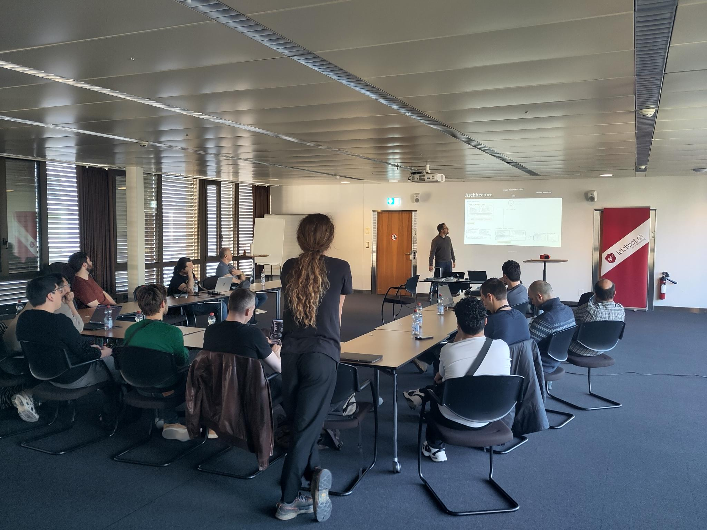
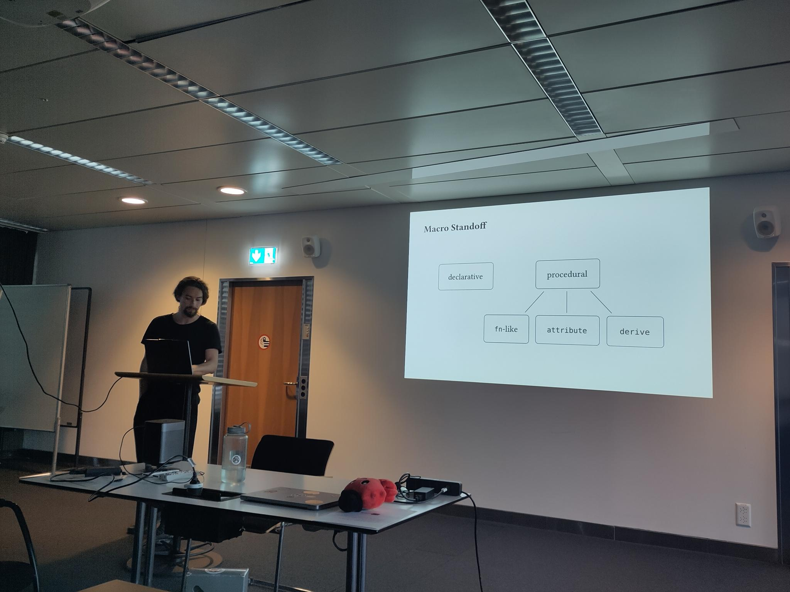

+++
date = 2026-04-07
title = "Rust Meetup #15"
description = "Full-stack Rust with TrailBase & Dioxus, and a deep dive into Rust macros"
authors = ["Jan Cristina"]

[taxonomies]
tags = ["Talks", "Macros", "Full-Stack", "TrailBase", "Dioxus"]

[extra]
image = "venue.jpeg"
+++

# Rust Basel Meetup #15 – Talk Evening @ letsboot

Our 15th on-site meetup, generously sponsored and hosted by [letsboot.ch](https://letsboot.ch) at Aeschenplatz 6, Basel.

### 🎤 The Talks

---

#### Roland Brand – Full-Stack Rust with TrailBase & Dioxus

Roland introduced us to [TrailBase](https://github.com/trailbaseio/trailbase) — an open, sub-millisecond, single-executable Firebase alternative written in Rust. He walked us through building a full-stack Rust application using TrailBase as the backend and [Dioxus](https://dioxuslabs.com/) on the frontend, showing just how far the Rust ecosystem has come for web development.

- [Slides](https://canva.link/w8gldapycv5cug9)
- [Demo repository](https://github.com/bar9/todomvc)

---

#### Jan Ferdinand Sauer – Macros in Rust: Syntax Extensions and Metaprogramming

Jan took us on a tour of Rust's macro system — from declarative `macro_rules!` all the way through to procedural macros (fn-like, attribute, and derive). A topic that can feel mysterious even to seasoned Rustaceans, explained clearly and with plenty of examples. Most of us definitely learned something new!

- [Slides & write-up](https://jfs.sh/blog/macros-in-rust/)

---

### 🧃 Community + Snacks

A great turnout, familiar faces and new ones alike, with lively discussion continuing well after the talks wrapped up.

---

### 🧡 Thank You!

- **letsboot.ch** – for the lovely venue, snacks, and drinks.

### ➕ Stay in Touch

- Join us on [Discord](https://rust-basel.ch/discord)
- Check out blog posts at [rust-basel.ch](https://rust-basel.ch)
- Look for upcoming events at [meetup.com](https://www.meetup.com/rust-basel)
- Or just drop by the next meetup and say hi!

---
