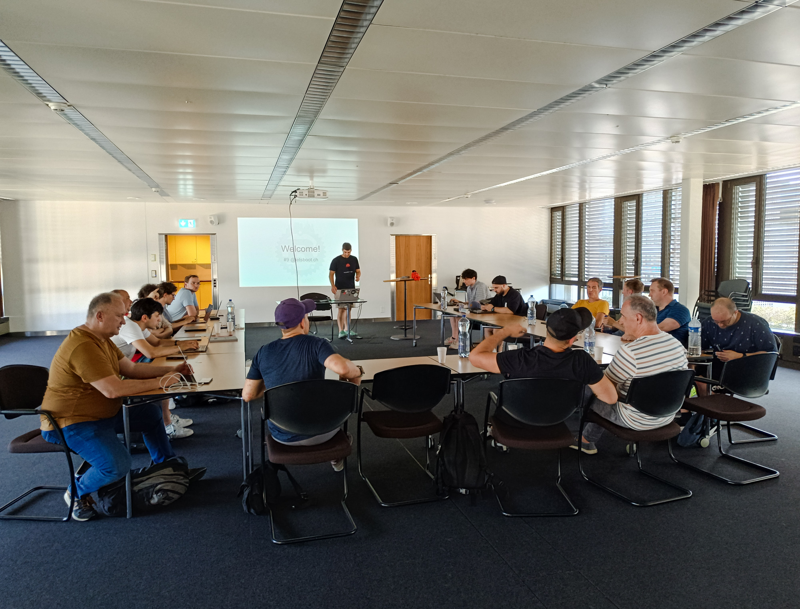
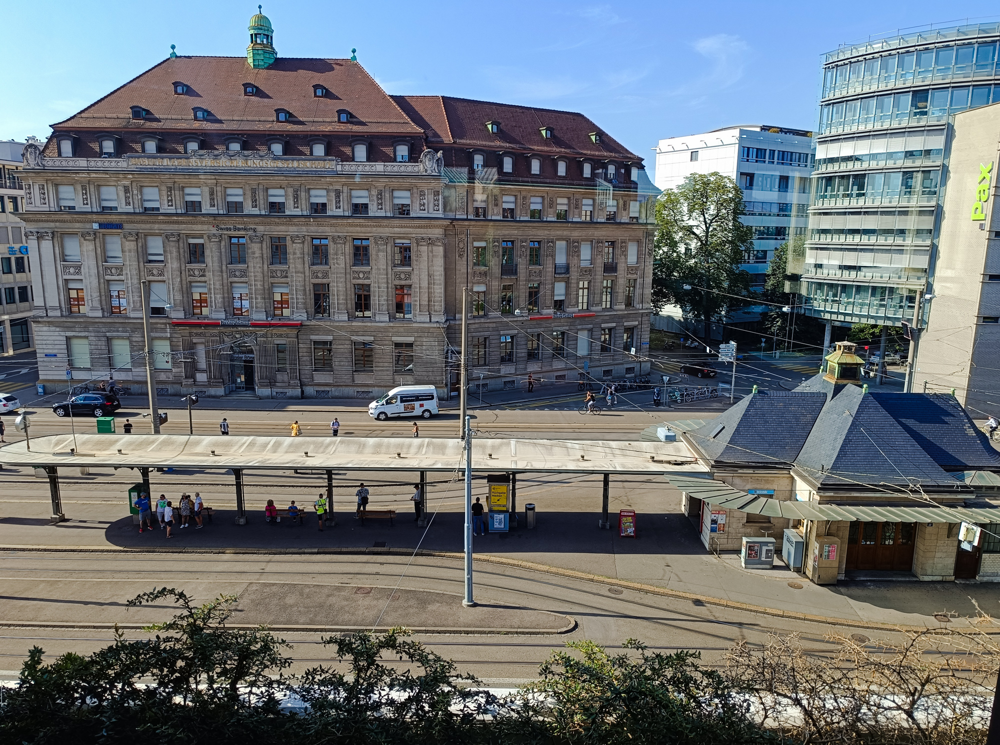

+++
date = 2024-07-30
title = "Rust Meetup #9"
description = "At letsboot's office, Aeschenplatz Basel. Mixed topics"
authors = ["Roland Brand"]
[taxonomies]
tags = ["Talks", "hurl", "tauri", "libgit2", "letsboot"]
[extra]
image = "ferris.jpg"
+++

# Engaged rustaceans even during holiday time
We enjoyed interesting talks and even more interesting discussions thereafter at the 9th Rust Basel meetup on Tuesday, July 30th.
The event sponsored by [letsboot](letsboot.ch) featured three talks that delved into diverse aspects of Rust development.

Even though it was well over 30 degrees outside and everybody in Basel seems to be on holiday, 18 rustaceans found their way
to the lofty office building behind the famous hammering man.

Here's a small recap of the event:

## Hurl
Silen Locatelli delved into the power of API testing with Hurl, which can benefit a wide range of projects, even outside the Rust world.

[> Silens talk and repo on github](https://github.com/SilenLoc/baselOne2024)

## Tauri
Oliver Hässler introduced Tauri, a Rust framework for crafting elegant user interfaces by leveraging web technologies.

## libgit2
Roland Brand showed a devtool built with Rust and libgit2 for modifying source code file headers.

[> Rolands repo on github](https://github.com/bar9/fhf)

Passionate Rust developers used the opportunity to connect, share experiences, and learn from each other, and chat over a beer and pizza.

## Missed the Meetup? Stay Connected!
Don't worry if you couldn't join us this time. 
Check out the [Rust Basel Meetup page](https://www.meetup.com/rust-basel/)
or our [Discord](https://discord.gg/29fSuFS5) to stay informed about upcoming events and connect with the local Rust community.
Keep on Rusting!

## A few impressions from the meetup:
Silen Locatelli introducing us to hurl

Yasing Gündüz opening the meetup

Apero

Great view from the location at Aeschenplatz
